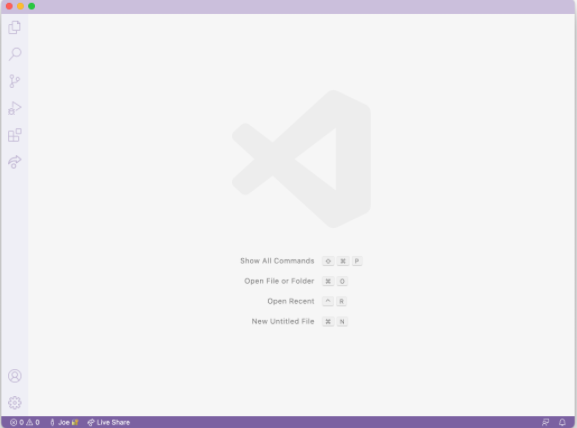
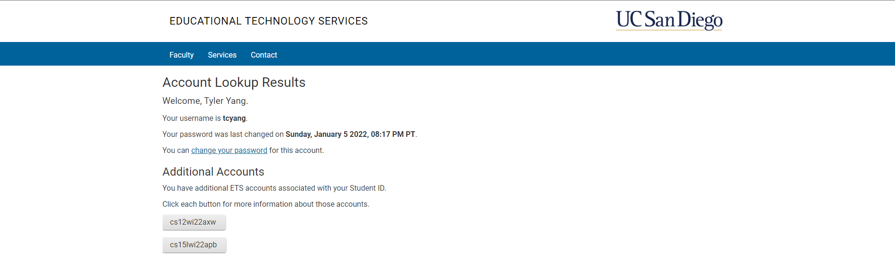
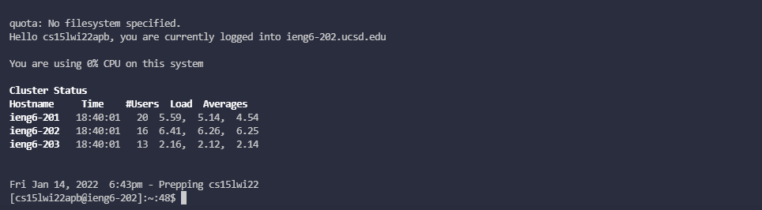
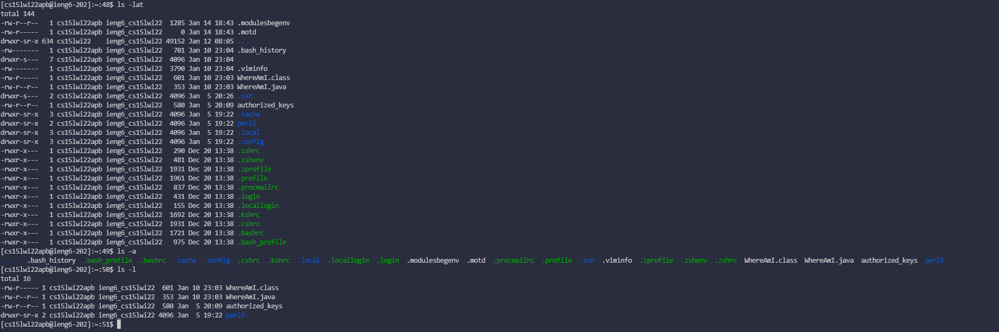
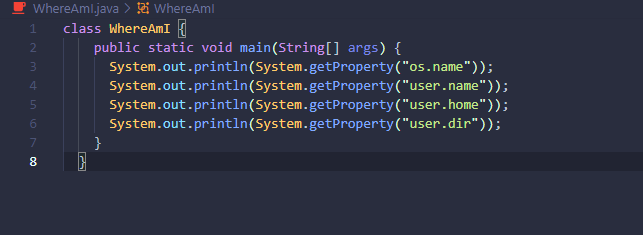
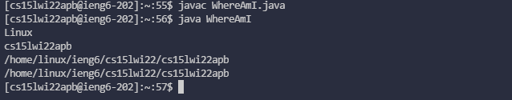
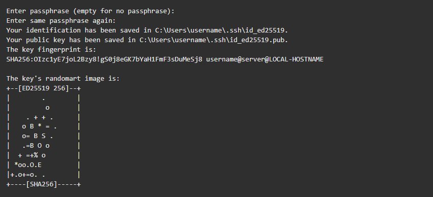
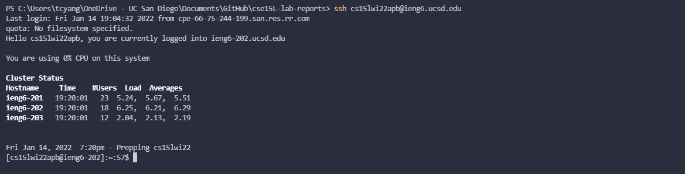
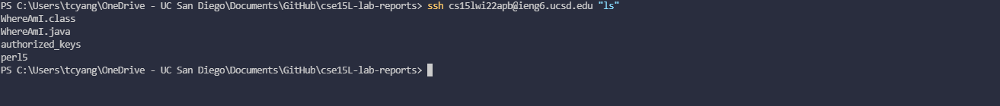

# Lab Report 1 - How to log into a course-specific account on ieng6

## 1. Installing VScode

To install VScode, go to the [VScode Website](https://code.visualstudio.com/) and follow the instructions to install
the application onto your operating system. 

Once installed, a window should open similar to this (there may be different colors):

---
## 2. Remotely Connecting

After installing VScode, if you are on a Windows operating system, you will first need to download the program called
[OpenSSH](https://docs.microsoft.com/en-us/windows-server/administration/openssh/openssh_install_firstuse). 

Afterwards, look up your UCSD student account on ieng6 by going to the [UCSD ETS](https://sdacs.ucsd.edu/~icc/index.php) website entering your username and PID.

If done correctly, a page similar to this should come up. For example, if you are trying to ssh into your cse15L ieng6 account, you would use the account `cs15lwi22apb`. However, your letters at the end of the account name may be different.

Now, open a terminal in VScode with *ctrl+*. Then type in `ssh` with your preferred ieng6 account. It should look something like `ssh cs15Lwi22zz@ieng6.ucsd.edu` with the zz being your specific account. 

If this is the first time connecting to ieng6 with your specific account, there may be a message that pops up that asks for authenticity. Type `yes` and then hit *enter*. Then enter your password and you should be taken to a page that looks similar to this...

(note: when entering your password, nothing should show up, however if you enter your password correctly and hit *enter* you should be taken here)

If this is your terminal, you have successfully logged into a computer on ieng6!

---
## 3. Trying Some Commands

Now that you are logged into a computer in the CSE Basement, you can try some different commands out.

Some commands to try are:

* `cd ~`
* `cd`
* `ls -lat`
* `ls -a`
* `ls <directory>` (here directory can be another ieng6 account)
* `cp /home/linux/ieng6/cs15lwi22/public/hello.txt ~/`
* `cat /home/linux/ieng6/cs15lwi22/public/hello.txt`

Run these commands and see what they produce.

When I ran `ls -lat`, `ls -a`, and `ls -l` on my terminal, I got these results...

To log out of your ieng6 account, just hit *ctrl+d* or run the command `exit`.

---
## 4. Moving Files with `scp`

A useful part about using ieng6 or working remotely in general is being able to copy files over from your cilent desktop to the remote computer. This is done by using the command `scp`.

For example, lets say I have a file called `WhereAmI.java` on my computer that looks something like this...

If I run this program on my own computer, I would get an output that prints my computer's operating system, username, etc. However, if I wanted to copy the file to ieng6 and then run it, I would first have to type `scp WhereAmI.java cs15lwi22zz@ieng6.ucsd.edu:~/` 

(note: replace WhereAmI.java and zz with the file you want to copy and your username respectively)

Then, log back into ieng6 account and type `ls` to see your newly copied file. You can now run the same file on ieng6 with the output now printing ieng6's operating system, username, etc.

---
## 5. Setting an SSH Key

When logging into ieng6 right now, you must input your password everytime you login which is time consuming and relatively annoying. A solution to inputting your password in everytime you want to log in is using something called a ssh key. 

The basic rundown of how a ssh key works is that you will create a pair of files, one private key and one public key, which will be used to login instead of your password. The private key will stay on the cilent computer while the public key will be placed in the ieng6 computer.

To get this set up, first run `ssh-keygen -t ed25519` in your VScode terminal. It will first ask where you would want to place the key pair (hit *enter* to accept the default path or change the path to where you want to place your keys), then ask for a passphrase. In this scenario, we will not using a passphrase so hit *enter* twice until you see something like this...

Now, if you are on a Windows operating system, open up the Start searchbar and type in `powershell`. Right-click the app and run it as administrator. Then type these commands in order...

* `Get-Service ssh-agent | Set-Service -StartupType Manual`
* `Start-Service ssh-agent`
* `Get-Service ssh-agent`
* `ssh-add ~\.ssh\id_ed25519`

Now we need to copy the public key into the `.ssh` directory on ieng6. First, create the directory on ieng6 by logging into your account and typing `mkdir .ssh`. Afterwards, log back out so you are on the cilent terminal. Now type this...

* `scp /users/tcyang/.ssh/id_ed25519.pub cs15lwi22apb@ieng6.ucsd.edu:~/.ssh/authorized_keys`

(you should have the first part be your key directory)

If done correctly, you should now be able to ssh and scp into ieng6 without having to enter a password.

---
## 6. Optimizing Remote Running

Now that you've learned how to ssh into a computer on ieng6 and how to copy files over from your computer onto your ieng6 account, there are some tricks to know in order to be more efficient when trying to do work with your ieng6 account. Some tips include

* adding quotation marks at the end of an `ssh` command you want to run inside ieng6 to directly run the command and immediately log back out

* adding semicolons to run multiple commands on the same line

(e.g. `scp` a file called `WhereAmI.java` and running in ieng6 and then staying logged in would look like)

