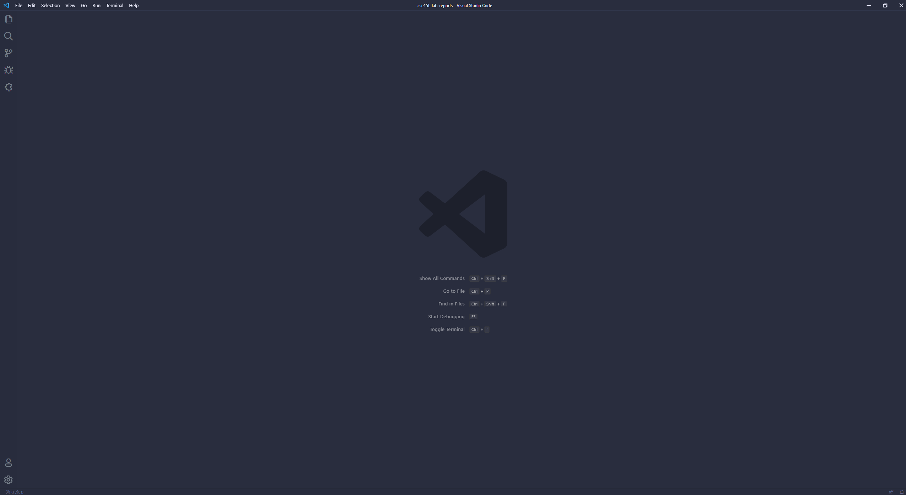

# Lab Report 1 - How to log into a course-specific account on ieng6

## 1. Installing VScode

To install VScode, go to the [VScode Website](https://code.visualstudio.com/) and follow the instructions to install
the application onto your operating system. 

Once installed, a window should open similar to this (there may be different colors):

---
## 2. Remotely Connecting

After installing VScode, if you are on a Windows operating system, you will first need to download the program called
[OpenSSH](https://docs.microsoft.com/en-us/windows-server/administration/openssh/openssh_install_firstuse). 

Afterwards, look up your UCSD student account on ieng6 by going to the [UCSD ETS](https://sdacs.ucsd.edu/~icc/index.php) website entering your username and PID.

If done correctly, a page similar to this should come up. For example, if you are trying to ssh into your cse15L ieng6 account, you would use the account `cs15lwi22apb`. However, your letters at the end of the account name may be different.

Now, open a terminal in VScode with *ctrl+*. Then type in `ssh` with your preferred ieng6 account. It should look something like `ssh cs15Lwi22zz@ieng6.ucsd.edu` with the zz being your specific account. 

If this is the first time connecting to ieng6 with your specific account, there may be a message that pops up that asks for authenticity. Type `yes` and then hit *enter*. Then enter your password and you should be taken to a page that looks similar to this...

(note: when entering your password, nothing should show up, however if you enter your password correctly and hit *enter* you should be taken here)

If this is your terminal, you have successfully logged into a computer on ieng6!

---
## 3. Trying Some Commands

Now that you are logged into a computer in the CSE Basement, you can try some different commands out.

Some commands to try are:

* `cd ~`
* `cd`
* `ls -lat`
* `ls -a`
* `ls <directory>` (here directory can be another ieng6 account)
* `cp /home/linux/ieng6/cs15lwi22/public/hello.txt ~/`
* `cat /home/linux/ieng6/cs15lwi22/public/hello.txt`

Run these commands and see what they produce.

When I ran `ls -lat`, `ls -a`, and `ls -l` on my terminal, I got these results...

To log out of your ieng6 account, just hit *ctrl+d* or run the command `exit`.

---
## 4. Moving Files with `scp`

A useful part about using ieng6 or working remotely in general is being able to copy files over from your cilent desktop to the remote computer. This is done by using the command `scp`.

For example, lets say I have a file called `WhereAmI.java` on my computer that looks something like this...

---
## 5. Setting an SSH Key

---
## 6. Optimizing Remote Running

