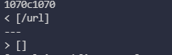

# Lab Report 5 - MarkdownParse vs CommonMark

## Test #1

>For the first test, I decided to choose test file `577.md` which looks like this...

>In order to find this test, I used the command `diff` on both the class markdown-parse implementation as well as my own implmentation. The outputs of using `diff` looked something like this...

>For this test in particular, I believe that my implementation of the parser is correct because the parser should not be outputting an image with an image extension, only links. Therefore, the expected output should be nothing. 

>In order to fix this, there should be a part of the code that checks the link to make sure that it is actually not an image. There is no part in the class implementation of `MarkdownParse.java` that does this yet but it could be a small if statement that uses the java method `.contains()`. This check would occur between the `openParen` and `closeParen` indexes. An example of where to place the if statement would be around here...

## Test #2

>For the second test, I decided to choose test file `580.md` which looks like this...

>Similar to how I found the first test, I used the command `diff` on both the class markdown-parse implementation and my own. The outputs of the command looks something like this...

>For this test, I also believe that my implementation is correct as `/url` should not be a valid link. Therefore, the expected output should be nothing. 

>To fix this, I would personally add a check to see if there is a period in the link. All URLs contain some form of internal period or dot so if there was a check to see if there are periods in the link. It could also be a simple if statement. The spot to put this if statement would be similar to the previous test as well. 
